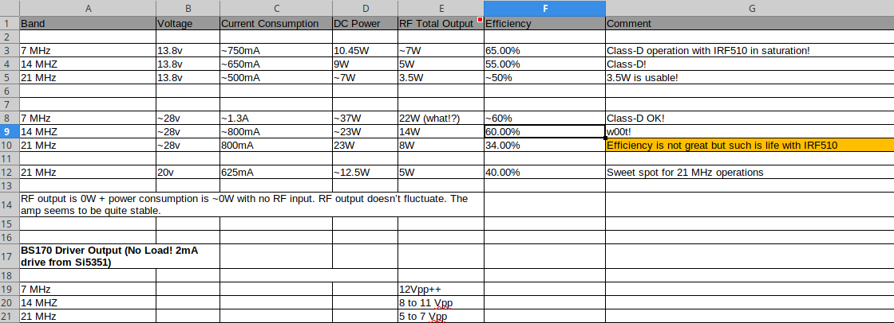
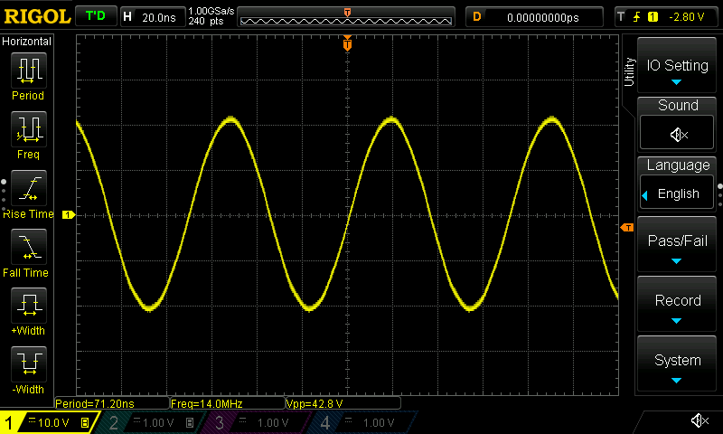
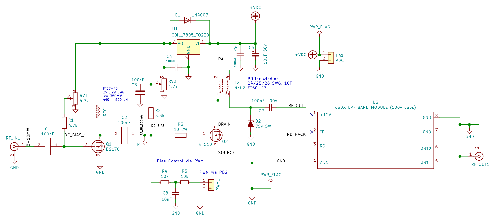
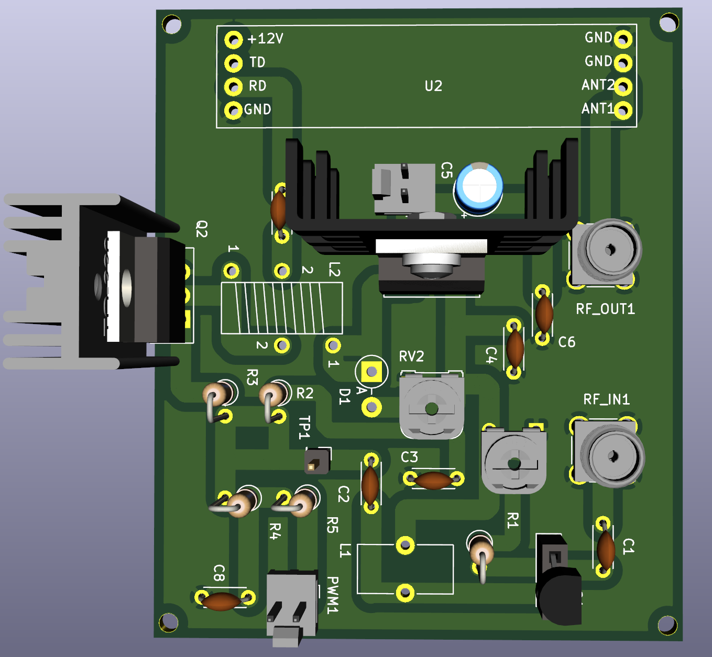
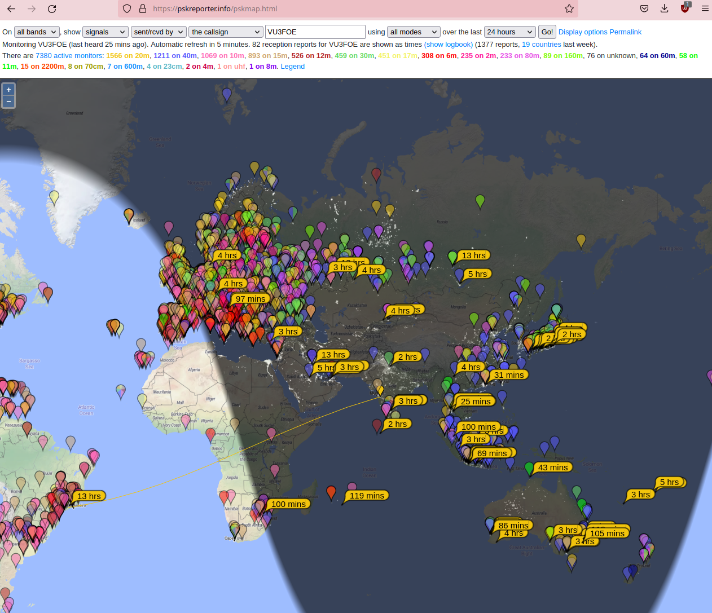

### HF-PA-v4

VU3CER's Robust `Class-D HF PA` for https://github.com/kholia/Easy-Digital-Beacons-v1
project for 40-20-17-15-10 bands.

For extra fun, use this PA with https://github.com/kholia/HF-Balcony-Antenna-System.

Jan-2022 UPDATE: https://github.com/kholia/HF-PA-v5 is up now.

This design aspires to be the standard mW-to-QRP-Gallon HF PA in the ~600 INR
(8 USD) design space. Well, it does much more than QRP now...

Design Constraints:

- PCB is to be homebrewed.

- PCB is single-sided - only one layer (side) is available for routing.

- IRF510 MOSFET needs to be on an edge to allow usage of heatsinks.

- Typical external linears (e.g. `PA150 HF Linear Amp`) need 2W minimum to
  function. So we need a minimum of 2W of RF output from our design.

- Minimal part count is strongly preferred. Low cost, and ease of availability
  are strong driving and deciding factors.

  The cost of this HF-PA-v4 system is less than one RD16HHF1 MOSFET ;)

- Reproducibility is a MUST! We focus a lot on this aspect by documenting each,
  and every detail possible.

- Repairability in the field is a MUST!

  Dhiru's finding: Repairing homebrewed PCBs is so much easier, and fun than
  reworking commercial `lead-free` PTH PCBs.

- No moving mechanical parts are allowed in the design - this rules out usage
  of (failure-prone) active cooling options like fans.

- We do NOT like the robustness of QCX, QDX, uSDX PAs. Removing heat from TO-92
  devices in a reliable way is not a trivial problem.

Note 0: All screenshots are clickable and zoomable.

Input: Few milliwatts is fine. Note: Si5351's output is around 8-10mW.

Output: With `v4.1` design, we are able to get 12W+ (total power) on the 15m
band with 30% efficiency! With a 5-pole LPF attached, we get ~10W RF output on
the 15m band. Efficiencies and output power levels are much higher on lower
bands! E.g. Power output @ 14 MHz is 14W+ with 51% efficiency - with LPF
attached!

Old results (kept for reference purposes):

Sample output for (14 MHz, 20v, ~725mA IN, 15W DC IN, 5.2W RF OUTPUT, With LPF
attached):

Note 1: The output power is software controllable (via `PWM grounding`) for
flexibility.

Note 2: The idea behind making these (and my other) design notes publicly
available is to deliver REPRODUCIBLE, flexible, home-brewable, standardized,
reasonable, and cost-effective solutions for some common problems. I include
many references, simulations, and notes in my projects to enable you to do your
own (better) designs - do share them ;)

Robustness Notes:

- Ensure that the IRF510 is fastened securely to the heat sink.

  Use lock washers, and thermal epoxy adhesive to ensure good mechanical
  contact.

- We recommend operating at 24v instead of >= 29v.

**Final recommendations from 05-November-2021 (for v4.3)**:

- Using 7805 is recommended instead of 7809 / 7912. Less is more ;)

- Enable `SI5351_DRIVE_8MA` option in code.

- Output results @ 24v:

  - 28.075 MHz (10m): 4W RF OUT (~14.5W DC IN)

  - 21.075 MHz (15m): 5W RF OUT (~13W DC IN)

  - 14.075 MHz (20m): 7W RF OUT (~13W DC IN)

For more power, use 7809 instead of 7805, and remember to take (much) more
care!

Please see the older https://github.com/kholia/HF-PA-v2 project for the
power-supply (over-current protected), and LPF designs.

Schematic:

PCB rendering (v4.1):

Note 3: The HF PA is connected to a 20m dipole over 55 meters of HLF-200 coax.

Note 4: The PCB is done using KiCad - a free, and open EDA software.

Note 5: This PA can be homebrewed from scratch in around 4 to 6 hours (one
afternoon, and an evening).

#### Notes

[From QRP Labs] Si5351A outputs a 3.3v square wave. The power output of Si5351A
is around 8-10mW (10 dBm). The BS170 based driver circuit amplifies this to
~200mW (23 dBm) for a gain of around 13 dB. The IRF510 finals provide a gain of
around 14dB and produce around 5W of RF power.

#### PA tuning process

- Remove the BS170 and IRF510 MOSFETS from their sockets.

- Set DC gate bias for BS170 to 0v. Now increase the bias (via trimpot) until
  the current consumption increases slightly (QRP Labs' process).

  You can also start by setting the gate bias to 2v directly ;)

- For IRF510, set gate bias to 3v. This ensures that IRF510 isn't turned ON -
  double-check this by monitoring the power consumption.

- Connect the MOSFET back, and measure RF output. Happy with the output power? -
  If yes, you are done else follow the next steps.

- Remove the MOSFET, increase the gate bias voltage in very small increments
  (0.1v types).

- Connect the MOSFET back, and measure power consumption without any RF input.
  Ensure that MOSFET remains OFF without any RF input.

- Apply RF input, and measure RF output.

- Repeat these steps as needed.

The [QRP Labs' procedure for bias adjustment](https://www.qrp-labs.com/images/pa/pa_simple_assembly_A4.pdf) and [this document](https://www.qrp-labs.com/images/ultimate3s/assembly_u3s.pdf) seem to have a better description of this process.

#### PA BOM

- 1 x IRF510 (Genuine Vishay parts are tried-and-tested) - 35 to 50 INR

  - The `SEC` (`SEC Electronics Inc`) branded IRF510(s) also work great!

  - The `SEC IRF510` can perform even better than Vishay's version. This
    particular result will vary between different product batches.

  - IRF510 with `International Rectifier` branding are most likely fake or "new
    old stock" if you are very lucky!

    Note: IR and Infineon have stopped manufacturing IRF510 MOSFETs.

  - AliExpress IRF510(s) are likely to be fake

  - The IR IRF510 gave ~3W versus 5.2W+ from SEC IRF510 versus ~5W from
    Vishay's IRF510!

    Note: The gate threshold voltage can vary even between two samples picked
    from the same manufacturer!

  - The Cgs ("gate capacitance") of a fake IRF510 is typically more than 1000pF
    on a LCR-T4 meter. This value is around ~400pF for genuine IRF510 parts on
    a LCR-T4 meter.

  - Ensure proper sourcing (trusted supply chain, etc) to get genuine parts

- BS170 MOSFET - 9 to 15 INR

- 2 x 4.7k Preset (Potentiometer) RM-065 - 12 INR

  - It is easier to get 5k (502) trimpots

- 1 x 3.3k 0.25W MFR - 2 INR

- 1 x 4.7k 0.25W MFR - 2 INR

- 1 x 10 Ohm Resistor 0.25W or 0.5W MFR - 2 INR (MOSFET gate resistor)

- [Optional] 2 x 10k Ohm - 0.25W Metal Film Resistor - 5 INR

- A very large heat sink - 50 to 175 INR - larger heatsink is better!

- 1 x 7805 (TO-220 package from CDIL) Voltage Regulator - 30 INR

  - The ST's 7805 is widely faked - let's avoid it or let's source it properly

- 1 x 1N4001 (or 1N4007) diode for 7805 protection - 2 INR

- 2 x SMA connectors (Vertical PCB mount) - 75 INR

- 1 x 10uF 50v Electrolytic Capacitor - 5 INR

- 8 x 100nF (104) 50v MLCC - 20 INR

- 1 x FT37-43 (Black Toroid, Fair-Rite 5943000201) - less than 25 INR (handles <= 350mW only)

- 1 x FT50-43 (Larger Black Toroid, Fair-Rite 5943000301) - less than 32 INR

- Misc: Relimate Connectors, Copper Clad PCB (Glass Epoxy), Various Consumables
  (~100 INR), SMA cables for testing, RF adapter (SMA Male to SO-239), M3 nuts
  and screws, TO-220 insulator kit

- Tools: LCR-T4 Meter (for measuring things), RF Power Meter

- Optional power supply: LM50-20B24 Mornsun SMPS - 24V 2.2A - 52.8W AC/DC SMPS - 700 INR

- Optional PPTC fuse

- PA Total Cost: Less than 600 INR

#### Power Supply + LPF BOM

See the following projects:

- https://github.com/kholia/HF-PA-v2
- https://github.com/kholia/HF-PA-v3
- 2 x 100 pF (50/100v)
- 1 x 180 pF (50/100v)
- 2 x T50-6 (Yellow Iron Dust code) toroids
- 25 SWG Winding Wire

Note: For LPF, use C0G 100v rated caps!

#### BOM + Equipment Sources

- https://www.semikart.com/ (IRF510, BS170, 100v NP0 LPF caps - Kemet and others)

  - 100v NP0 LPF caps from `Multicomp Pro` brand seem pretty cost-effective

  - 1N5374B 75V 5W Zener Diode (optional - for SWR protection)

- https://www.electronicscomp.com/

  - IRF510, BS170, regular caps, ST voltage regulators

  - Female berg strip (2.54mm pitch)

- https://www.electroncomponents.com/ (transistors, connectors, consumables, misc)

  - https://www.electroncomponents.com/LM7805-5V-Positive-Regulator

  - https://www.electroncomponents.com/BS170-N-channel-Switching-FET

  - https://www.electroncomponents.com/1N4001

  - https://www.electroncomponents.com/mica-insulator-to-220-set-kit

- https://www.sunrom.com/ (regular ceramic caps, SMA connectors)

- https://projectpoint.in/

  - Transistors, regular caps, voltage regulators, pots / trimmers, MFR resistors, misc

  - 2-Pin High Quality Relimate Connectors (all those 2-pin headers are actually Relimate Connectors)

  - Copper Magnetic Winding Wire - 29 SWG and 25 SWG

  - CDIL 7805

  - 3-Pin Relimate Cable Female to Female (High Quality 2500mA) - 'TO-220 socket'

  - 2-Pin Relimate Cable Female (High Quality 2500mA) - for power

  - 2-Pin Relimate Male Header

- Semikart, eBay (`gr_makis`) - Toroids

- https://www.onlinetps.com/shop/ ('IR branded' IRF510 - not recommended!)

- https://www.ktron.in/ (SMA connectors)

- [LCR-T4 LCR Meter](https://www.techtonics.in/lcr-t4-12864-lcd-graphical-transistor-tester-resistance-capacitance-esr-scr-meter)

- https://robu.in/ (voltage boost module)

- See https://github.com/kholia/HF-PA-v2 and https://github.com/kholia/HF-PA-v3 sources too

Note for international buyers: The BOM can be carefully sourced via Mouser and DigiKey.

#### O(Current consumption)

The ESP8266 usually draws a peak current of about 250mA after it wakes up and
then more or less constantly draws around 70mA before it goes back to sleep.

DS3231 -> 5mA

Si5351 -> ~50 to 100mA

PA -> Less than 1 A (rms)

Upper bound -> 1.4A maximum.

#### Tips

MOSFETs are sensitive with regards to ESD and high soldering temperatures. Use
best practices when dealing with MOSFETs and perhaps always ;)

By using these `TO-220 Sockets`, we can easily support any MOSFET pinout. This
technique allows usage of `off-pcb` heat sinks with a lot of flexibility. It
also avoids common ESD + MOSFET problems as well. The gate bias can be easily
checked by safely removing the MOSFET from the TO-220 socket. Also, this socket
idea allows us to safely eliminate the LDO from the design.

A burnt 78(L)05 regulator can easily eat up 4-5W of power by itself. If there
is no RF output but power is being consumed then check your linear regulator.

#### Future ideas

- Use a `PPTC fuse` in the PA voltage line (oscillations can be a real problem,
  and can be nasty) - Sandeep Lohia (VU3SXT).

- Add a `Type K Thermocouple` based temperature monitoring to ensure safety.

- Alternatively, use ACS712 to monitor the current consumption to ensure
  safety.

#### References

See [References.md](./References.md).

#### Credits

This design uses ideas, and support from Hans Summers (G0UPL, QRP Labs), VU3SXT
(Sandeep Lohia), VU2ASH, Mr. Bhatnagar (VU2SPF), AC7LX, and PY2OHH.

Also see https://github.com/kholia/HF-PA-v3#credits and https://github.com/kholia/HF-PA-v2#credits.
